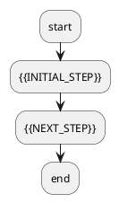

# 📄 {{TITLE}}

> {{DESCRIPTION}}

---

## 🔍 背景 & 概述 (Context & Overview)

{{OVERVIEW}}

---

## 📝 详细内容 (Detailed Content)

{{CONTENT}}

---

## 📊 架构/流程图 (Architecture / Flowchart)

> [!TIP]
> 上图已适配 **飞书画板模式 (Lark Drawing Board)**。切换至“画板样式”后文字可直接自由编辑。

---

## 📌 关键要点 (Key Takeaways)

{{TAKEAWAYS}}

---
