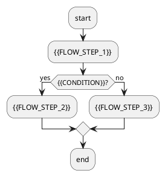

# 🚀 {{TITLE}}

> {{DESCRIPTION}}

---

## 📅 讨论概览 (Discussion Overview)

- **日期**: {{DATE}}
- **核心议题**: {{CORE_TOPICS}}
- **参与状态**: Active Session

---

## 💡 关键洞察 (Key Insights)

{{INSIGHTS}}

---

## 🛠️ 技术细节 & 决策 (Technical Details & Decisions)

{{TECHNICAL_DETAILS}}

---

## 📊 逻辑架构 & 流程 (Logic & Workflows)

> [!TIP]
> 上图已适配 **飞书画板模式 (Artboard Style)** 语法。在飞书中点击“编辑 PlantUML”并切换至“画板样式”即可获得矢量可编辑效果。

---

## ✅ 行动项 (Action Items)

| 任务 | 优先级 | 状态 |
| :--- | :--- | :--- |
{{ACTION_ITEMS}}

---
